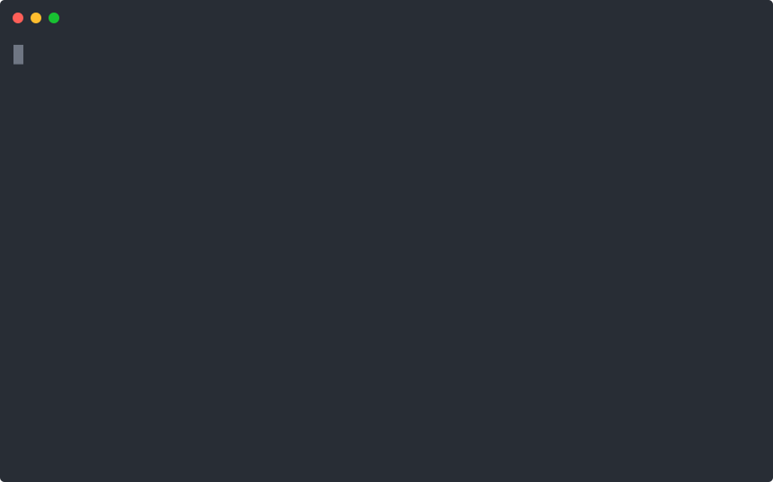

# symlock

[](https://github.com/echoVic/symlock/actions/workflows/ci.yml)
[](LICENSE)

**Symbol-level locking & conflict prevention for parallel AI coding agents.**
Language-agnostic. Drop-in. Actually open source (Apache-2.0).



When you run N coding agents (Claude Code, Codex, Gemini CLI, …) in parallel git
worktrees, worktrees keep them from *overwriting* each other — but nothing stops
two agents from editing the **same function** and colliding at merge time, where
the fix isn't a one-line patch but a re-do of one agent's work.

`symlock` prevents that collision *before* it happens. Agents declare which
**symbol** (function / class / method) they're about to edit and acquire a
symbol-level lock. If another agent already holds an overlapping region, the
claim fails loudly with a structured warning — so work gets redirected before a
single wasted token. And when two agents *do* land in the same file, `symlock
merge` combines their work with a conservative, symbol-aware 3-way merge that
[git can't do](#semantic-merge).

```
$ symlock symbols auth.ts
function login          L1-3
function logout         L5-7
class    TokenStore     L9-16
method   TokenStore.issue   L10-12

$ symlock claim --agent codex  auth.ts login     # ok
$ symlock claim --agent claude auth.ts logout    # ok — different function
$ symlock claim --agent claude auth.ts login     # CONFLICT (exit 2)
CONFLICT: login (L1-3) overlaps an active claim:
  - login held by codex (L1-3)
```

## Why symlock (vs. the alternatives)

- **Actually open source** — Apache-2.0, no "source-available / free for ≤20 people" asterisk.
- **Language-agnostic** — symbol boundaries come from [tree-sitter](https://tree-sitter.github.io/), not regex. TypeScript/JavaScript, Python, Go, and Rust today; more via tree-sitter grammars.
- **Composable, not a walled garden** — a single binary + JSON output. Any orchestrator (Claude Squad, cmux, Vibe Kanban, or your own) can shell out to it, and coding agents drive it via the bundled [Agent Skill](skills/symlock/SKILL.md) — no MCP handshake, no daemon. symlock is the missing *infrastructure*, not another dashboard.
- **Conservative by design** — it locks reviewable, nameable regions and warns on any overlap. It never silently merges anything (semantic AST merge is the next milestone, and will stay conservative: auto-merge only provably non-overlapping edits, everything else goes to a human).

## Demo

See it end-to-end — two agents, two git worktrees, one shared repo:

```bash
./demo.sh
```

It builds the binary, spins up a throwaway repo with two worktrees sharing one
lock store, and shows two agents claiming different functions (both succeed)
then colliding on the same one (blocked with exit 2, before any edit).

## Install

```bash
cargo install --path .   # or: cargo build --release
```

## Usage

```bash
symlock init                                   # create .symlock/ in the repo
symlock symbols <file>                         # list lockable symbols
symlock claim  [--agent <id>] <file> <symbol>  # reserve a symbol (exit 2 on conflict)
symlock release [--agent <id>] [--file f] [--symbol s]
symlock status                                 # show all active claims
symlock --json <cmd>                           # machine-readable output for orchestrators
```

`--agent` can be omitted if you export `SYMLOCK_AGENT=<id>` (handy so each agent
sets its identity once per worktree).

### Use it from an AI coding agent (skill)

symlock ships an [Agent Skill](https://agentskills.io/) that teaches Claude Code
/ Codex / Cursor / OpenCode to **claim before they edit** and back off on
conflict. Install it with the [skills](https://www.skills.sh/) CLI:

```bash
npx skills add echoVic/symlock
```

Or copy [`skills/symlock/SKILL.md`](skills/symlock/SKILL.md) into your agent's
skills directory by hand. This is the intended way to wire symlock into a
parallel-agent workflow — no MCP handshake, no daemon, just a CLI on PATH plus
the behavior the skill injects.

### Exit codes (part of the contract)

| code | meaning |
|------|---------|
| `0`  | success / claim granted |
| `2`  | conflict — an overlapping symbol is already claimed |
| `1`  | error (unsupported file, symbol not found, no `.symlock`, …) |

## Semantic merge

Prevention is the first half; the second is merging cleanly when two agents
*did* edit the same file. `symlock merge` does a **conservative, symbol-aware
3-way merge**:

```bash
symlock merge --base base.ts --ours ours.ts --theirs theirs.ts -o merged.ts
# exit 0: merged cleanly   exit 2: conflict left for a human   exit 1: error
```

Where plain `git` sees two edits on adjacent lines and gives up:

```
$ git merge-file ours.js base.js theirs.js
git: CONFLICT

$ symlock merge --base base.js --ours ours.js --theirs theirs.js
function a(){return 111;}   # ← your change
function b(){return 222;}   # ← their change, cleanly combined
```

**It only ever auto-merges what it can prove is safe.** The rule: try a normal
line-level merge first; if that conflicts, accept the result *only* when the two
sides changed **disjoint top-level symbols** and nothing outside them (imports,
layout, sibling code). Anything else — both sides editing the same function, an
added/removed/renamed symbol, a changed import, a parse failure, an unsupported
language — is returned as a conflict for a human, with the reason stated. It
re-parses its own output before trusting it. **It would rather refuse than merge
wrong.**

Drop it into git as a merge driver:

```gitattributes
# .gitattributes
*.ts merge=symlock
*.go merge=symlock
```
```
# .git/config
[merge "symlock"]
  name = symlock semantic merge
  driver = symlock merge --base %O --ours %A --theirs %B -o %A --path %P
```

## Status

**Conflict prevention + semantic merge.** Symbol extraction (TS/JS, Python, Go,
Rust), cross-process safe claim/release, an Agent Skill that makes agents
claim-before-edit, and a conservative symbol-aware 3-way merge. Roadmap: more
languages, richer merge coverage.

## License

Apache-2.0.
